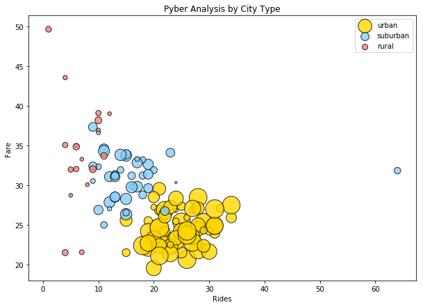

###Observations:
    - Rides in rural areas has the biggest spread in fares
    - Urban areas has the lowest fares and the most drivers
    - Urban areas represent 2/3 of total rides
    


```python
import matplotlib.pyplot as plt
import pandas as pd
import numpy as np

ride = 'ride_data.csv'
city = 'city_data.csv'

ride_df = pd.read_csv(ride)
city_df = pd.read_csv(city)

# Merge the two datasets and create df
city_ride_df = pd.merge(ride_df, city_df, how='left', on='city')

city_ride_df.head()

```


<div>
<style>
    .dataframe thead tr:only-child th {
        text-align: right;
    }

    .dataframe thead th {
        text-align: left;
    }

    .dataframe tbody tr th {
        vertical-align: top;
    }
</style>
<table border="1" class="dataframe">
  <thead>
    <tr style="text-align: right;">
      <th></th>
      <th>city</th>
      <th>date</th>
      <th>fare</th>
      <th>ride_id</th>
      <th>driver_count</th>
      <th>type</th>
    </tr>
  </thead>
  <tbody>
    <tr>
      <th>0</th>
      <td>Sarabury</td>
      <td>2016-01-16 13:49:27</td>
      <td>38.35</td>
      <td>5403689035038</td>
      <td>46</td>
      <td>Urban</td>
    </tr>
    <tr>
      <th>1</th>
      <td>South Roy</td>
      <td>2016-01-02 18:42:34</td>
      <td>17.49</td>
      <td>4036272335942</td>
      <td>35</td>
      <td>Urban</td>
    </tr>
    <tr>
      <th>2</th>
      <td>Wiseborough</td>
      <td>2016-01-21 17:35:29</td>
      <td>44.18</td>
      <td>3645042422587</td>
      <td>55</td>
      <td>Urban</td>
    </tr>
    <tr>
      <th>3</th>
      <td>Spencertown</td>
      <td>2016-07-31 14:53:22</td>
      <td>6.87</td>
      <td>2242596575892</td>
      <td>68</td>
      <td>Urban</td>
    </tr>
    <tr>
      <th>4</th>
      <td>Nguyenbury</td>
      <td>2016-07-09 04:42:44</td>
      <td>6.28</td>
      <td>1543057793673</td>
      <td>8</td>
      <td>Urban</td>
    </tr>
  </tbody>
</table>
</div>


```python
#filter dataframe

urban = city_ride_df[city_ride_df['type']=='Urban']
suburban = city_ride_df[city_ride_df['type']=='Suburban']
rural = city_ride_df[city_ride_df['type']=='Rural']
```


```python
# Create key variables on Urban, Suburban, Rural

###URBAN

#Avg fare Urban 
urban_avg_fare = urban.groupby(['city']).mean()['fare']

#ride per city
urban_ride_count = urban.groupby(['city']).count()['ride_id']

#driver count per city
urban_driver_count = urban.groupby(['city']).mean()['driver_count']
```


```python
###SUBURBAN

#Avg fare subrban 
suburban_avg_fare = suburban.groupby(['city']).mean()['fare']

#ride per city
suburban_ride_count = suburban.groupby(['city']).count()['ride_id']

#driver count per city
suburban_driver_count = suburban.groupby(['city']).mean()['driver_count']
```


```python
###RURAL

#Avg fare rural 
rural_avg_fare = rural.groupby(['city']).mean()['fare']

#ride per city
rural_ride_count = rural.groupby(['city']).count()['ride_id']

#driver count per city
rural_driver_count = rural.groupby(['city']).mean()['driver_count']

```


```python
#Create Bubbleplot
plt.figure(figsize= (10, 7))
plt.scatter(urban_ride_count, urban_avg_fare, 
            s=10*urban_driver_count, c='gold', edgecolors='black', 
            linewidths=1, marker='o', alpha=0.8, label='Urban')

plt.scatter(suburban_ride_count, suburban_avg_fare, 
            s=10*suburban_driver_count, c='lightskyblue', edgecolors='black', 
            linewidths=1, marker='o', alpha=0.8, label='Suburban')

plt.scatter(rural_ride_count, rural_avg_fare, 
            s=10*rural_driver_count, c='lightcoral', edgecolors='black', 
            linewidths=1, marker='o', alpha=0.8, label='Rural')

#Title, x&y axis
plt.title("Pyber Analysis by City Type")
plt.xlabel("Rides")
plt.ylabel("Fare")


# Create a legend for chart

plt.legend(['urban', 'suburban', 'rural'], loc='best')
plt.show()
```





```python
# * % of Total Rides by City Type
# Create df for pie charts
ride_group = city_ride_df.groupby('type')
type_count = ride_group['type'].count() 
type_count

#Create Pie Chart
groups = ['Rural', 'Suburban', 'Urban']
colors = ["red", "lightcoral", "lightskyblue"]
explode = (0, 0.05, 0.075)
plt.title("% of Total Rides by City Type")
plt.pie(type_count, explode=explode, labels=groups, colors=colors,
        autopct="%1.1f%%", shadow=True, startangle=90)
plt.axis("equal")
plt.show()
                        
```


```python
# * % of Total Drivers by City Type

#repeat above, change key value
driver_count = ride_group['driver_count'].sum() 
driver_count

groups = ['Rural', 'Suburban', 'Urban']
colors = ["red", "lightcoral", "lightskyblue"]
explode = (0.25, 0.05, 0.075)
plt.title("% of Total Drivers by City Type")
plt.pie(driver_count, labels=groups, colors=colors,
        autopct="%1.1f%%", shadow=False, startangle=270)
plt.axis("equal")
plt.show()
```


```python
# * % of Total Fares by City Type

#repeat above, change key value
fare_count = ride_group['fare'].sum()
fare_count

groups = ['Rural', 'Suburban', 'Urban']
colors = ["red", "lightcoral", "lightskyblue"]
explode = (0.1, 0.05, 0.075)
plt.title("% of Total Fare by City Type")
plt.pie(fare_count, labels=groups, colors=colors,
        autopct="%1.1f%%", shadow=True, startangle=90)
plt.axis("equal")
plt.show()
```


